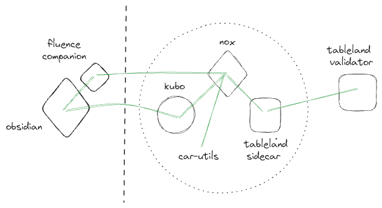
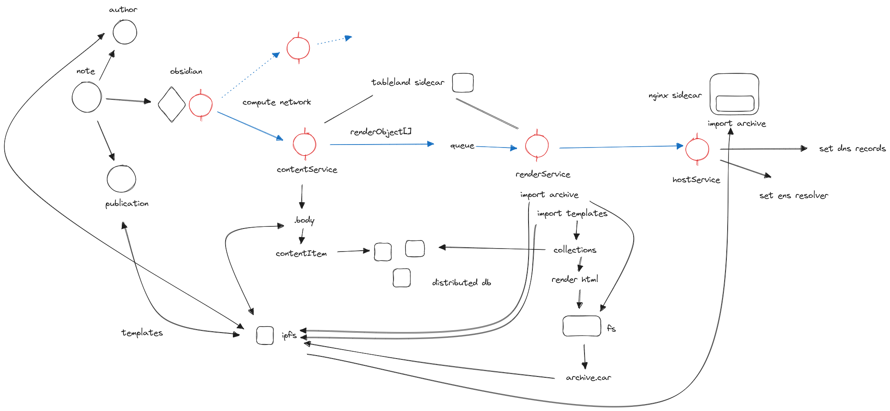

cd fluence-companion 
npm run start

obsidian-plugin
when dev .. run npm run dev and reload obsidian

deploy updated workers
cd fluence
nvm use 18.19
rm -rf .fluence/workers.yaml
fluence workers deploy

in other tab
cd ../fluence-companion 
npm run aqua:compile
npm run start

## Overview of parts involved 

### data flows (december 2023)

### diagram (october 2023) 

